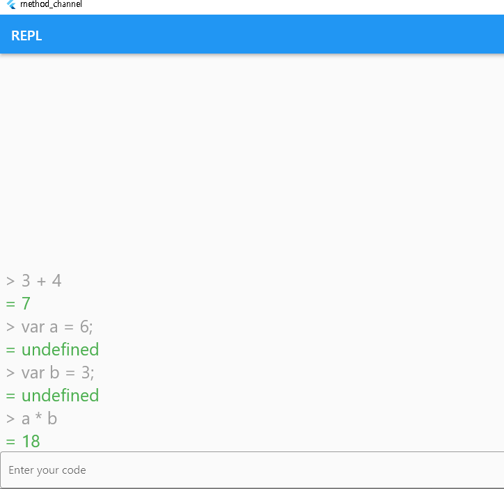

# method_channel

네이티브 라이브러리를 플러터 프레임워크에서 사용하기 위한 방법 중 하나인 ffi와 ffigen을 이용한 윈도우용 프로젝트 입니다.

일반적으론 ffi_plugin용 프로젝트를 생성하여 로컬 플러그인을 생성하고 실제 프로젝트에 import하여 사용하지만,

해당 프로젝트는 실제 프로젝트에서 바로 .dll 파일을 생성한 뒤 동적으로 참조하는 방식을 사용합니다.

### 시작하기

가벼운 자바스크립트 엔진 라이브러리인 duktape를 사용하여 REPL(read-eval-print-loop)를 구현합니다.

[덕테이프](https://duktape.org/) 사이트에서 다운받은 폴더를 pubspec.yaml 파일이 있는 프로젝트 계층에 src라는 이름의 폴더를 생성하여 붙여넣습니다.

(ffi_gen 프로젝트 생성 시 기본적으로 추가되는 ffigen_app.c와 .h 파일도 포함시켰습니다.)

그 후 폴더 안에 CMakeLists.txt 파일을 만들어 다음과 같은 내용을 붙여넣습니다.

```cmake
# The Flutter tooling requires that developers have CMake 3.10 or later
# installed. You should not increase this version, as doing so will cause
# the plugin to fail to compile for some customers of the plugin.
add_library(swh_lib SHARED
  ffigen_app.c
  #ffigen_app.c
  duktape.c
)
set_target_properties(swh_lib PROPERTIES
  PUBLIC_HEADER ffigen_app.h
  PUBLIC_HEADER duktape.h
  PRIVATE_HEADER duk_config.h
  #LIBRARY_OUTPUT_DIRECTORY "${PROJECT_BINARY_DIR}/runner/"
  RUNTIME_OUTPUT_DIRECTORY "${PROJECT_BINARY_DIR}/runner/"
  #ARCHIVE_OUTPUT_DIRECTORY "${CMAKE_INSTALL_PREFIX}/"
  OUTPUT_NAME "method_channel"
)

if(WIN32)
set_target_properties(swh_lib PROPERTIES
  WINDOWS_EXPORT_ALL_SYMBOLS ON
)
endif(WIN32)

target_compile_definitions(swh_lib PUBLIC DART_SHARED_LIB)
```

swh_lib는 원하는 이름으로 수정해도 됩니다.

set_tartget_properties의 RUNTIME_OUTPUT_DIRECTORY 매개변수만 설정해도 정상 작동합다. 나머지는 나중에 사용할 일을 대비해 주석처리합니다.

위 처럼 설정하면 <프로젝트폴더> → build → windows → runner 폴더에 디버그모드인 경우 Debug 폴더, 릴리즈모드인 경우 Release 폴더에 dll이 자동 생성됩니다.

이후 별도 경로 설정 없이 다트 파일에서 <OUTPUT_NAME>.dll 을 읽어오면 됩니다.

위 작업이 끝나면 루트 프로젝트 계층에 ffigen.yaml 파일을 생성하여 다음과 같은 내용을 붙여넣습니다.

```yaml
# Run with `flutter pub run ffigen --config ffigen.yaml`.
#name: FfigenAppBindings
name:        DuktapeBindings
description: |
             Bindings for `src/duktape.h`.
             Bindings for `src/ffigen_app.h`.

             Regenerate bindings with `flutter pub run ffigen --config ffigen.yaml`.
#output: 'lib/ffigen_app_bindings_generated.dart'
output:      'lib/ffi/duktape_bindings_generated.dart'
headers:
  entry-points:
    - 'src/duktape.h'
    - 'src/ffigen_app.h'
  include-directives:
    - 'src/duktape.h'
    - 'src/ffigen_app.h'
preamble:    |
             // ignore_for_file: always_specify_types
             // ignore_for_file: camel_case_types
             // ignore_for_file: non_constant_identifier_names
comments:
  style:  any
  length: full
```

위 내용은 ffigen 패키지와 관련된 내용입니다.

name은 ffigen으로 자동 생성될 클래스의 이름입니다.

description은 주석으로 자동 생성될 내용입니다.

output은 자동 생성될 파일의 경로입니다.

headers는 자동 생성될 클래스가 참조할 헤더파일의 경로입니다.

위 작업이 끝나면 windows → CMakeList.txt 파일을 열고 50~60번째 즘 add_subdirectory 명령어가 모여있는 위치에 다음과 같은 문구 추가.

```dart
add_subdirectory("../src" "${CMAKE_CURRENT_BINARY_DIR}/swh_lib")
```

위 명령어는 windows 폴더의 루트 폴더(pubspec.yaml이 있는 위치)에 있는 src 폴더를 CMAKE_CURRENT_BINARY_DIR 환경변수에 swh_lib라는 폴더로 복사하라는 명령어입니다.

src 폴더나 swh_lib는 원하는 이름으로 수정해도 됩니다.

이후 다음 명령어를 실행합니다.

이제 앱을 빌드 할 때 src 폴더에 존재하는 파일을 읽어 .exe 파일이 생성되는 경로에 dll파일이 자동으로 생성되며, DynamicLibrary.open 함수를 통해 dll 파일을 읽어옵니다.

```bash
flutter pub run ffigen --config ffigen.yaml
```

그러면 output에 설정한 경로에 dart 파일이 생성됩니다.

### 구현

mvc 패턴을 구현하고 보일러 플레이트를 최소화 하기 위해 다음 패키지를 사용합니다.

| 제목            |
|---------------|
| flutter_bloc  |
| flutter_hooks |
| freezed       |
| get_it        |
| hooked_bloc   |
| injectable    |

실행 사진은 다음과 같습니다.



### 참고 사항
bloc 패키지에서 emit을 할 때, evalstring 상태가 emit 됨과 거의 동시에 response 상태가 emit 되므로 evalstring 상태가 무시되는 현상이 발생합니다.

이를 구분해주기 위해 고의적으로 1초 delay를 지정했습니다.
